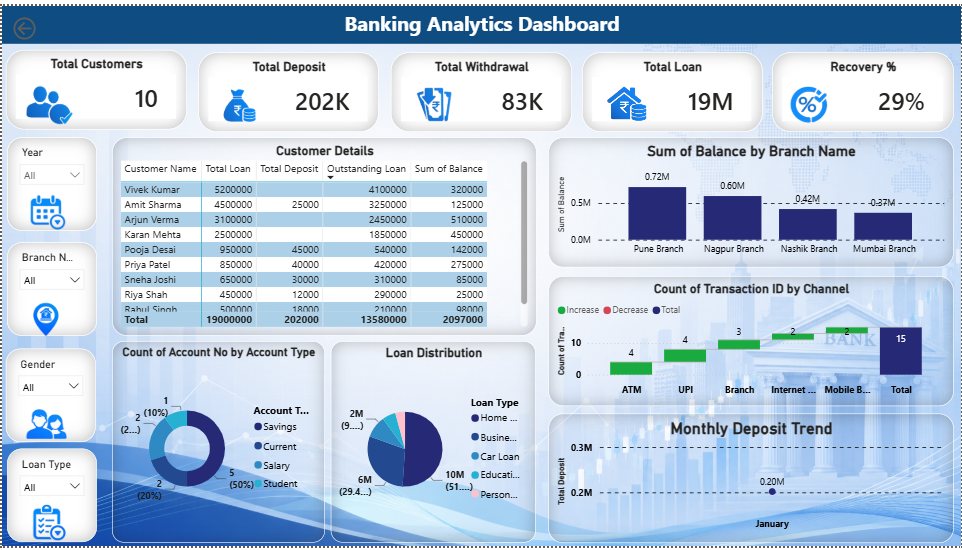

# Banking Analytics Dashboard

## 📌 Project Overview
This Power BI dashboard provides insights into banking operations by analyzing customer deposits, withdrawals, loans, account types, and branch performance.

## 🛠 Tools Used
- Power BI Desktop
- Power Query
- DAX
- Excel/CSV

## 📊 Dashboard Features
- Total Customers
- Total Deposit
- Total Withdrawal
- Total Loan
- Recovery Percentage
- Branch-wise Balance Analysis
- Loan Distribution
- Account Type Analysis
- Monthly Deposit Trend
- Transaction Channel Analysis

## 📷 Dashboard Preview

## 👨‍💻 Developed By
Vaibhav Patil
